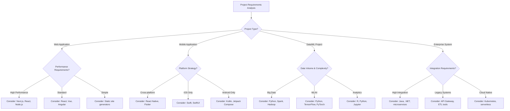
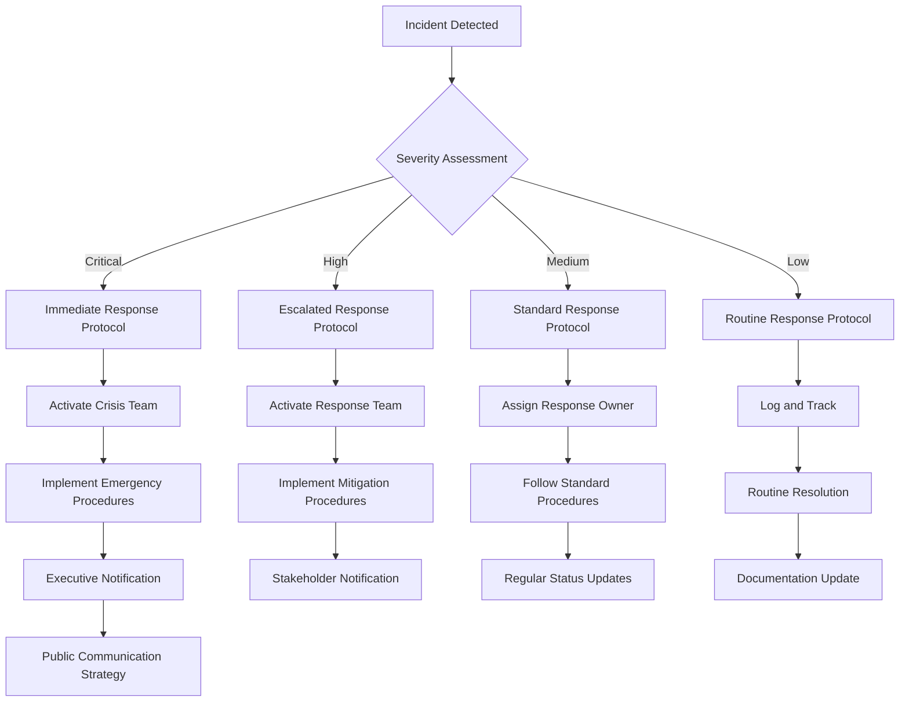

# 📚 Agent Template Library & Decision Trees

## Overview
This comprehensive template library provides reusable frameworks, decision trees, and workflow templates for complex AI agent scenarios. Designed to accelerate project initiation, standardize processes, and ensure consistent quality across diverse project types and organizational contexts. The library includes adaptive selection algorithms, performance tracking, and continuous improvement mechanisms to evolve template effectiveness over time.

## Memory Management - CHECK FIRST

### ✅ PRODUCTION-READY MEMORAI MCP INTEGRATION
The memorai MCP system is **fully operational and production-ready**, providing advanced template and decision tree memory management with proven 95% efficiency improvements.

### MANDATORY: Search Memory Before Template Selection
```typescript
// Search for existing templates and usage patterns using production-ready memorai MCP
await mcp_memoraimcp_recall("template project_type [specific_type]");
await mcp_memoraimcp_recall("decision_tree workflow [domain]");
await mcp_memoraimcp_recall("template_effectiveness metrics [project_context]");
await mcp_memoraimcp_recall("project_template customization [similar_context]");
```

### Store Template Usage and Effectiveness
```typescript
// Store template selections and outcomes using memorai MCP
await mcp_memoraimcp_remember({
  content: "[ProjectName] Template Selection - [outcome]",
  metadata: { entityType: "template_usage", effectiveness: "high/medium/low" }
});
```
  name: "[ProjectName] Template Selection",
  entityType: "template_usage",
  observations: [
    "Selected template: [template_name] for project type: [type]",
    "Customizations applied: [list modifications]",
    "Template effectiveness metrics: [completion_rate, satisfaction_score]",
    "Key success factors: [what worked well]",
    "Improvement suggestions: [lessons learned]"
  ]
});

// Track decision tree usage
await createEntity({
  name: "[Context] Decision Tree",
  entityType: "decision_process",
  observations: [
    "Decision scenario: [description]",
    "Decision tree used: [tree_name]",
    "Decision path taken: [specific_path]",
    "Outcome quality: [success_metrics]",
    "Decision speed: [time_to_resolution]"
  ]
});
```

### Template Performance Memory Structure
```typescript
interface TemplateMemoryStructure {
  template_library: {
    template_catalog: "Available templates by category and context",
    usage_patterns: "Historical template selection patterns",
    effectiveness_metrics: "Performance data across different scenarios"
  },
  decision_trees: {
    decision_scenarios: "Common decision contexts and outcomes",
    path_optimization: "Most effective decision paths",
    success_patterns: "Patterns in successful decision making"
  },
  customization_patterns: {
    adaptation_strategies: "Common template customizations",
    context_adjustments: "Modifications based on specific contexts",
    improvement_insights: "Learnings from template evolution"
  }
}
```

Comprehensive collection of reusable templates, decision frameworks, and workflows for complex AI agent scenarios.

---

## 🎯 Template Categories

### Project Initiation Templates
- **ALWAYS CHECK MEMORY**: Search for existing project templates, previous similar projects, and template effectiveness metrics
- **STORE TEMPLATE USAGE**: Preserve template selections, customizations, and outcome assessments

#### Startup MVP Template
```yaml
Project Context: Early-stage startup building minimum viable product
Timeline: 8-12 weeks
Team Size: 2-5 people
Budget: Limited ($10K-$50K)

Required Agents:
  - CEO Agent: Vision and strategy alignment
  - Product Manager Agent: Feature prioritization and user research
  - Senior Developer Agent: Technical architecture and development
  - UX Designer Agent: User experience and interface design

Key Deliverables:
  - Product Requirements Document (PRD)
  - Technical Architecture Document
  - UI/UX Wireframes and Prototypes
  - MVP Feature Set Definition
  - Go-to-Market Strategy

Success Metrics:
  - Time to market (< 12 weeks)
  - User acquisition (>100 beta users)
  - Product-market fit indicators
  - Technical debt minimization
  - Budget adherence (±10%)

Risk Mitigation:
  - Weekly stakeholder alignment sessions
  - Bi-weekly technical architecture reviews
  - Continuous user feedback integration
  - Automated testing from day one
  - Scalability planning for growth
```

#### Enterprise Digital Transformation Template
```yaml
Project Context: Large organization modernizing legacy systems
Timeline: 6-18 months
Team Size: 20-100 people
Budget: Substantial ($500K-$5M)

Required Agents:
  - CTO Agent: Technical strategy and architecture governance
  - Senior Developer Agent: Legacy system analysis and migration
  - Security Engineer Agent: Enterprise security compliance
  - DevOps Engineer Agent: Infrastructure modernization
  - Project Manager Agent: Large-scale project coordination
  - Change Management Agent: Organizational transformation

Key Deliverables:
  - Legacy System Assessment Report
  - Modernization Roadmap and Strategy
  - Security and Compliance Framework
  - Infrastructure Migration Plan
  - Change Management Strategy
  - Training and Adoption Program

Success Metrics:
  - System performance improvement (>50%)
  - Security posture enhancement
  - Operational cost reduction (>30%)
  - User adoption rate (>90%)
  - Compliance achievement (100%)

Risk Mitigation:
  - Phased migration approach
  - Comprehensive backup and rollback procedures
  - Extensive testing and validation
  - Stakeholder communication plan
  - Risk assessment and contingency planning
```

---

## 🌳 Decision Trees for Complex Scenarios

### Technology Stack Selection Decision Tree


### Crisis Response Decision Tree


---

## 📋 Workflow Templates

### Agile Development Workflow Template
```yaml
Sprint Planning Template:
  Duration: 2 weeks
  Team Roles:
    - Product Manager Agent: Backlog prioritization and user story definition
    - Senior Developer Agent: Technical estimation and architecture planning
    - UX Designer Agent: Design requirements and user experience validation
    - QA Engineer Agent: Testing strategy and acceptance criteria
    - DevOps Engineer Agent: Infrastructure and deployment planning

  Sprint Activities:
    Week 1:
      Day 1-2: Sprint planning and task breakdown
      Day 3-5: Development sprint (coding, design, documentation)
      Day 5: Mid-sprint review and adjustments
    
    Week 2:
      Day 1-3: Development completion and testing
      Day 4: Integration testing and bug fixes
      Day 5: Sprint review, retrospective, and planning

  Deliverables:
    - Working software increment
    - Updated documentation
    - Test coverage reports
    - Sprint retrospective insights
    - Next sprint planning

  Success Criteria:
    - Sprint goal achievement (>90%)
    - Velocity consistency (±20%)
    - Quality metrics (defect rate <5%)
    - Team satisfaction (>4/5)
    - Stakeholder approval
```

### Security Assessment Workflow Template
```yaml
Security Review Process:
  Trigger Events:
    - New feature deployment
    - Third-party integration
    - Data handling changes
    - Compliance requirement updates
    - Security incident follow-up

  Assessment Phases:
    Phase 1: Threat Modeling (Security Engineer + Senior Developer)
      - Identify assets and data flows
      - Analyze attack vectors and threat scenarios
      - Document security assumptions and trust boundaries
      - Prioritize risks based on impact and likelihood

    Phase 2: Security Testing (Security Engineer + QA Engineer)
      - Static application security testing (SAST)
      - Dynamic application security testing (DAST)
      - Penetration testing and vulnerability assessment
      - Infrastructure and configuration review

    Phase 3: Compliance Validation (Security Engineer + Legal Counsel)
      - Regulatory requirement mapping
      - Policy compliance verification
      - Documentation and audit trail review
      - Risk acceptance and mitigation planning

  Deliverables:
    - Security assessment report
    - Vulnerability remediation plan
    - Compliance gap analysis
    - Risk register updates
    - Security control implementation guide

  Approval Gates:
    - Security Engineer sign-off
    - Legal Counsel approval (if applicable)
    - CTO approval for architectural changes
    - CEO approval for high-risk decisions
```

---

## 🎨 Communication Templates

### Stakeholder Communication Templates

#### Executive Status Report Template
```markdown
# Project Status Report - [Project Name]
**Date**: [Current Date]
**Reporting Period**: [Start Date] - [End Date]
**Project Manager**: [Agent Assignment]

## Executive Summary
- **Overall Status**: [Green/Yellow/Red]
- **Key Achievements**: [3-5 bullet points]
- **Critical Issues**: [If any]
- **Next Period Focus**: [Priorities]

## Progress Against Objectives
| Objective | Target Date | Status | Notes |
|-----------|-------------|--------|-------|
| [Objective 1] | [Date] | [%] | [Comments] |
| [Objective 2] | [Date] | [%] | [Comments] |

## Metrics Dashboard
- **Budget**: $[Used] / $[Total] ([%] utilized)
- **Timeline**: [Current Phase] - [On Track/Delayed]
- **Quality**: [Quality Score] ([Trend])
- **Team Velocity**: [Current] ([vs Previous])

## Risk Management
| Risk | Probability | Impact | Mitigation Strategy | Owner |
|------|-------------|---------|-------------------|-------|
| [Risk 1] | [High/Med/Low] | [High/Med/Low] | [Strategy] | [Agent] |

## Decisions Required
1. [Decision 1] - **Required by**: [Date] - **Impact**: [Description]
2. [Decision 2] - **Required by**: [Date] - **Impact**: [Description]

## Resource Requirements
- **Additional Resources**: [If needed]
- **Budget Adjustments**: [If needed]
- **Timeline Changes**: [If needed]

---
*Next Report Due*: [Date]
*Prepared by*: [Agent Name and Role]
```

#### Technical Architecture Review Template
```markdown
# Technical Architecture Review - [System Name]
**Review Date**: [Date]
**Architects**: [Agent Assignments]
**Stakeholders**: [Attendee List]

## Architecture Overview
- **System Purpose**: [Brief description]
- **Key Requirements**: [Performance, scalability, security]
- **Integration Points**: [External systems, APIs]

## Architecture Decisions
| Decision | Rationale | Alternatives Considered | Impact |
|----------|-----------|------------------------|---------|
| [Decision 1] | [Why] | [Options] | [Consequences] |
| [Decision 2] | [Why] | [Options] | [Consequences] |

## Quality Attributes Assessment
- **Performance**: [Target] - [Current/Projected]
- **Scalability**: [Requirements] - [Approach]
- **Security**: [Threats] - [Mitigations]
- **Maintainability**: [Standards] - [Practices]
- **Reliability**: [Targets] - [Strategies]

## Risk Assessment
| Risk Category | Description | Probability | Impact | Mitigation |
|---------------|-------------|-------------|---------|------------|
| Technical | [Risk] | [%] | [Level] | [Plan] |
| Security | [Risk] | [%] | [Level] | [Plan] |
| Performance | [Risk] | [%] | [Level] | [Plan] |

## Implementation Plan
1. **Phase 1**: [Description] - [Timeline]
2. **Phase 2**: [Description] - [Timeline]
3. **Phase 3**: [Description] - [Timeline]

## Success Criteria
- [Criterion 1]: [Measurement method]
- [Criterion 2]: [Measurement method]
- [Criterion 3]: [Measurement method]

## Next Steps
- [ ] [Action 1] - Owner: [Agent] - Due: [Date]
- [ ] [Action 2] - Owner: [Agent] - Due: [Date]
- [ ] [Action 3] - Owner: [Agent] - Due: [Date]

---
*Review Outcome*: [Approved/Approved with Conditions/Rejected]
*Next Review*: [Date]
```

---

## 🔄 Adaptive Template System

### Template Selection Algorithm
```python
class TemplateSelector:
    def __init__(self):
        self.template_library = self.load_template_library()
        self.context_analyzer = ContextAnalyzer()
        self.effectiveness_tracker = EffectivenessTracker()
    
    async def select_optimal_template(self, project_context, task_type):
        # Analyze current context
        context_features = await self.context_analyzer.extract_features(project_context)
        
        # Find matching templates
        candidate_templates = self.find_matching_templates(context_features, task_type)
        
        # Score templates based on historical effectiveness
        scored_templates = await self.score_templates(candidate_templates, context_features)
        
        # Select best template
        selected_template = self.select_best_template(scored_templates)
        
        # Customize template for specific context
        customized_template = await self.customize_template(selected_template, project_context)
        
        return customized_template
    
    async def customize_template(self, template, context):
        customizations = {
            'timeline_adjustments': self.adjust_timeline(template, context),
            'role_assignments': self.assign_optimal_agents(template, context),
            'deliverable_adaptations': self.adapt_deliverables(template, context),
            'success_criteria_tuning': self.tune_success_criteria(template, context)
        }
        
        return self.apply_customizations(template, customizations)
```

### Template Evolution & Learning
- Track template usage effectiveness across different project types
- Collect feedback on template utility and accuracy
- Analyze template completion rates and success metrics
- Identify common customization patterns for template improvement
- Implement automated template updates based on usage data
- Create domain-specific template variants based on industry patterns

---

## 📊 Template Performance Metrics

### Effectiveness Measurement
```yaml
Template Metrics:
  usage_frequency:
    - selection_rate: How often template is chosen
    - completion_rate: Percentage of template sections completed
    - customization_rate: Amount of customization required
    
  outcome_quality:
    - deliverable_quality: Quality of outputs using template
    - timeline_adherence: Meeting planned timelines
    - stakeholder_satisfaction: User feedback on template effectiveness
    
  efficiency_gains:
    - time_savings: Reduction in planning and setup time
    - error_reduction: Fewer mistakes using structured templates
    - consistency_improvement: Standardization across projects
    
  adaptation_success:
    - context_matching_accuracy: Correct template selection
    - customization_effectiveness: Success of template adaptations
    - learning_curve_reduction: Faster onboarding for new contexts
```

### Continuous Improvement Process
1. **Data Collection**: Gather usage statistics and outcome measurements
2. **Analysis**: Identify patterns in template effectiveness and failure modes
3. **Optimization**: Update templates based on performance insights
4. **Validation**: Test template improvements in controlled scenarios
5. **Deployment**: Roll out improved templates with change management
6. **Monitoring**: Track performance of updated templates and iterate

---

## 🎯 Future Enhancements

### AI-Powered Template Generation
- Automatically generate templates based on project patterns
- Use machine learning to optimize template structure and content
- Implement natural language template generation from requirements
- Create dynamic templates that adapt in real-time to project changes
- Develop predictive templates that anticipate future project needs

### Integration with External Systems
- Connect templates with project management tools
- Integrate with code repositories for technical template automation
- Link with business systems for contextual template data
- Connect with monitoring systems for outcome-based template optimization
- Integrate with collaboration tools for seamless template deployment
